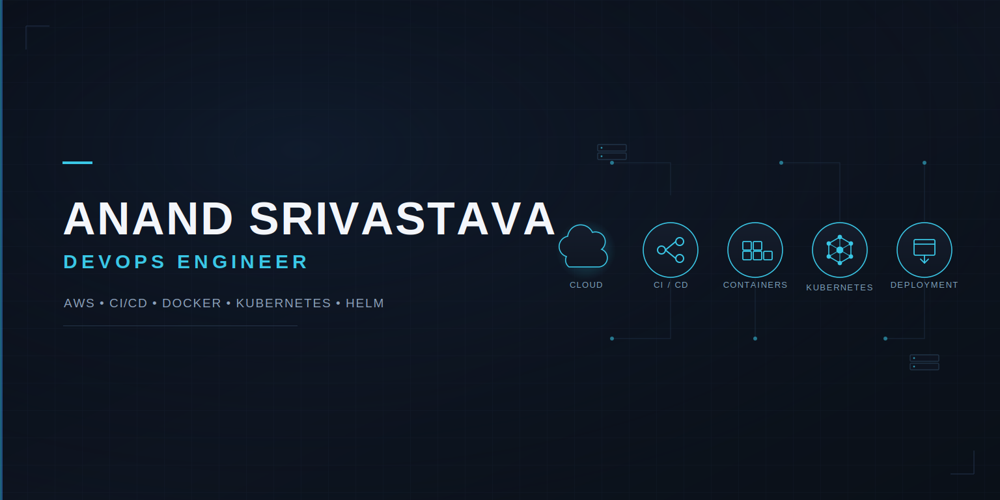

<p align="center">
  
</p>

<h1 align="center">Anand Srivastava</h1>

<p align="center">
  <strong>DevOps Engineer | AWS | CI/CD | Docker | Kubernetes</strong>
</p>

<p align="center">
  Cloud Infrastructure • CI/CD Automation • Containerization • Kubernetes
</p>

<p align="center">
  <a href="https://www.linkedin.com/in/anand-srivastava-79b51918">
    
  </a>
  <a href="https://github.com/anandtech-devops">
    
  </a>
  <a href="https://ananddevops.website">
    
  </a>
  <a href="mailto:anandsri13796@gmail.com">
    
  </a>
</p>

---

## About Me

I'm a **DevOps Engineer with 2+ years of experience** focused on cloud infrastructure, CI/CD automation, containerization, and application deployment.

I work with AWS, Jenkins, Docker, Kubernetes, Helm, Git, Maven, Linux, Prometheus, and Grafana to build and automate application delivery workflows.

My approach is centered around:

- Automating repetitive deployment tasks
- Building reliable CI/CD pipelines
- Containerizing applications with Docker
- Deploying and managing workloads on Kubernetes
- Managing Kubernetes applications using Helm
- Monitoring applications and infrastructure
- Troubleshooting deployment and runtime issues

Currently expanding my knowledge of **Terraform and Infrastructure as Code**.

---

## Technical Skills

### Cloud & Infrastructure

`AWS` `EC2` `S3` `RDS` `ECR` `IAM` `VPC` `EBS` `ELB/ALB` `Route 53` `CloudFront` `Lambda` `ECS` `SNS`

### CI/CD & Version Control

`Jenkins` `GitHub Actions` `Git` `GitHub` `Maven`

### Containers & Kubernetes

`Docker` `Kubernetes` `Helm` `Ingress` `Services` `Deployments` `containerd` `Flannel`

### Monitoring & Observability

`Prometheus` `Grafana`

### Operating Systems & Scripting

`Linux` `Bash` `Python`

### Application Technologies

`Java` `Spring Boot` `MySQL`

### Currently Learning

`Terraform` `Infrastructure as Code`

---

# Featured Project

## Food Delivery Order Management System

An end-to-end DevOps project for building, containerizing, deploying, and monitoring a Spring Boot application using AWS and Kubernetes.

**Repository:**  
https://github.com/anandtech-devops/Food-Delivery-Service

### Technology Stack

| Area | Technology |
|---|---|
| Application | Java, Spring Boot |
| Database | MySQL, AWS RDS |
| Source Control | Git, GitHub |
| Build | Maven |
| CI/CD | Jenkins |
| Containerization | Docker |
| Image Registry | Amazon ECR |
| Orchestration | Kubernetes |
| Deployment | Helm |
| Networking | Kubernetes Ingress, Flannel |
| Monitoring | Prometheus, Grafana |
| Infrastructure | AWS EC2 |

---

## Project Architecture

```text
                         ┌─────────────────┐
                         │    Developer    │
                         └────────┬────────┘
                                  │
                                  ▼
                         ┌─────────────────┐
                         │     GitHub      │
                         │ Source Control  │
                         └────────┬────────┘
                                  │
                                  ▼
                         ┌─────────────────┐
                         │     Jenkins     │
                         │     CI / CD     │
                         └────────┬────────┘
                                  │
                         ┌────────┴────────┐
                         │                 │
                         ▼                 ▼
                  ┌─────────────┐   ┌─────────────┐
                  │    Maven    │   │    Docker   │
                  │    Build    │   │    Build    │
                  └─────────────┘   └──────┬──────┘
                                           │
                                           ▼
                                  ┌─────────────────┐
                                  │     AWS ECR     │
                                  │ Container Image  │
                                  └────────┬────────┘
                                           │
                                           ▼
                             ┌────────────────────────┐
                             │   Kubernetes Cluster   │
                             │      Self Managed      │
                             └───────────┬────────────┘
                                         │
                                  Helm Deployment
                                         │
                                         ▼
                               ┌──────────────────┐
                               │  Spring Boot App │
                               └────────┬─────────┘
                                        │
                           ┌────────────┴────────────┐
                           │                         │
                           ▼                         ▼
                    ┌──────────────┐          ┌─────────────┐
                    │   Ingress    │          │  AWS RDS    │
                    │   Service    │          │    MySQL    │
                    └──────────────┘          └─────────────┘

                              Monitoring
                                  │
                     ┌────────────┴────────────┐
                     ▼                         ▼
               ┌─────────────┐          ┌─────────────┐
               │ Prometheus  │          │   Grafana   │
               └─────────────┘          └─────────────┘
```

---

## CI/CD Workflow

The project follows an automated application delivery workflow:

```text
Git Push
   │
   ▼
Jenkins Pipeline
   │
   ├── Checkout Source Code
   │
   ├── Maven Build
   │
   ├── Docker Image Build
   │
   ├── Authenticate with AWS ECR
   │
   ├── Push Image to ECR
   │
   ├── Deploy using Helm
   │
   └── Verify Kubernetes Rollout
```

---

## Key Implementation Areas

### Continuous Integration

- Source code is maintained in GitHub.
- Jenkins checks out the application source.
- Maven is used to build the Spring Boot application.
- Docker images are created as part of the pipeline.

### Containerization

- Application is packaged into a Docker image.
- Container images are stored in Amazon ECR.
- Kubernetes pulls the application image from ECR during deployment.

### Kubernetes Deployment

- Application is deployed to a self-managed Kubernetes cluster.
- Helm is used to manage Kubernetes application releases.
- Kubernetes Services provide internal application connectivity.
- Ingress is used for application access.
- Flannel provides pod networking within the cluster.

### Database

- Application uses MySQL for persistent data.
- AWS RDS is used as the managed database service.
- Database configuration is supplied to the Kubernetes workload through deployment configuration and Kubernetes Secrets.

### Monitoring

- Prometheus is used for metrics collection.
- Grafana is used for monitoring and visualization.

---

# Kubernetes & Helm

The project uses Helm to package and manage the Kubernetes deployment.

```text
food-delivery/
│
├── Chart.yaml
├── values.yaml
│
└── templates/
    ├── deployment.yaml
    ├── service.yaml
    └── ingress.yaml
```

Helm allows deployment configuration such as the container image, replica count, service configuration, and ingress settings to be managed through chart values instead of maintaining completely separate manifests for every environment.

---

# AWS Services Used

| AWS Service | Purpose |
|---|---|
| EC2 | Kubernetes and Jenkins infrastructure |
| ECR | Docker image registry |
| RDS | Managed MySQL database |
| IAM | Access and permissions |
| VPC | Network infrastructure |
| S3 | Object storage / static hosting practice |
| Route 53 | DNS management practice |
| ELB / ALB | Load balancing practice |
| CloudFront | CDN practice |

---

# DevOps Tools

<p align="center">


</p>

---

# What I Practice

```text
Cloud Infrastructure
        │
        ▼
Source Control
        │
        ▼
CI/CD Automation
        │
        ▼
Application Build
        │
        ▼
Containerization
        │
        ▼
Container Registry
        │
        ▼
Kubernetes Deployment
        │
        ▼
Helm-based Release Management
        │
        ▼
Monitoring & Observability
        │
        ▼
Troubleshooting & Continuous Improvement
```

---

# Current Learning

I'm currently strengthening my knowledge in:

- Terraform
- Infrastructure as Code
- Advanced Kubernetes
- Cloud architecture
- Kubernetes troubleshooting
- Monitoring and observability
- DevOps automation

---

# Connect With Me

I'm interested in opportunities involving:

**DevOps • AWS • Cloud Infrastructure • CI/CD • Kubernetes • Docker • Platform Engineering**

<p align="center">

<a href="https://www.linkedin.com/in/anand-srivastava-79b51918">
  
</a>

<a href="https://github.com/anandtech-devops">
  
</a>

<a href="https://ananddevops.website">
  
</a>

<a href="mailto:anandsri13796@gmail.com">
  
</a>

</p>

---

<p align="center">
  <strong>Automate • Deploy • Monitor • Improve</strong>
</p>
